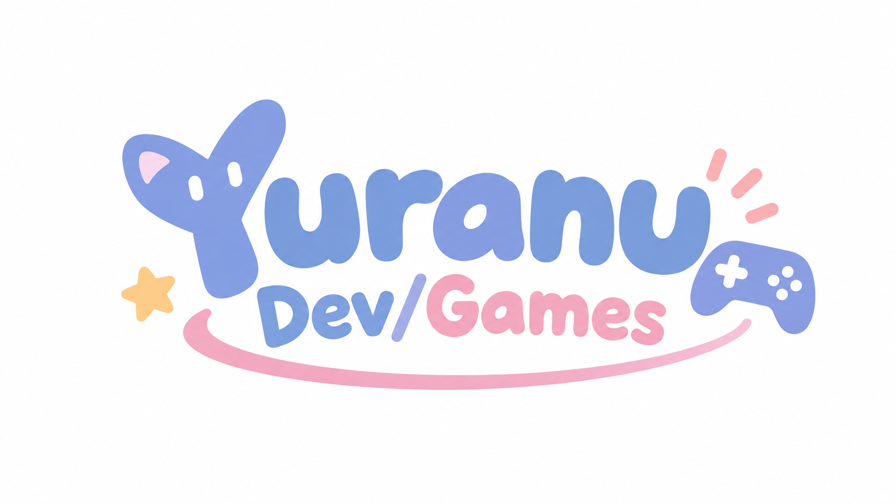

<!-- ========================= -->
<!--        HEADER IMAGE       -->
<!-- ========================= -->

  

  <strong>Game Developer • Creator</strong>

  🎮 Game Development　💻 Software　🔌 Embedded　🚗 Automotive

---

## 👋 About Me

I'm **Yuranu**, an IT student currently studying in a
**Game Development Course**.

I enjoy creating games, tools, VRChat content,
embedded systems, and various experimental projects.

- 🎮 Game Development
- 🕹️ Unity / VRChat
- 💻 C# / C++ / Python
- 🔌 ESP32 / Embedded Systems
- 🚗 Automotive / CAN
- 🎵 Audio Programming
- 🧩 Windows / Linux

---

## 🎮 Game Development

I'm currently focusing on **game development** as part of my studies.

I mainly work with:

I also explore VRChat, Unity tools, audio systems,
UI design, and other game-related technologies.

---

## 🛠️ Technologies

 

 

---

# 📊 GitHub Statistics

---

# 🔥 Contribution Streak

---

# 🚀 Projects

<table>
<tr>

<td width="50%">

### 🎮 Game Development

Game development projects created
while studying game development.

</td>

<td width="50%">

### 🕹️ VRChat

VRChat worlds, avatars, tools,
and Unity-related projects.

</td>

</tr>

<tr>

<td width="50%">

### 🚗 Automotive

Navigation systems, CAN,
GNSS and automotive electronics.

</td>

<td width="50%">

### 🔌 Embedded

ESP32, IoT, hardware projects
and embedded systems.

</td>

</tr>
</table>

---

# 📈 GitHub Activity

---

💙 Thanks for visiting my profile!

 

